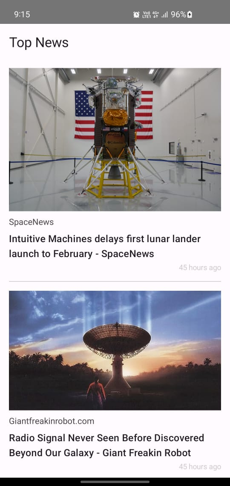

# Top News Feed

  

    <video width="320" height="240" controls>
      <source src="./readme/r_video.mp4" type="video/mp4">
    </video>
  

  

    (./readme/s.jpg)
  

## What this project brings to you:
- **MVVM Design Pattern:** The project follows the MVVM (Model-View-ViewModel) design pattern, incorporating a repository and use case approach for better separation of concerns.

- **Kotlin Coroutines and Flow:** Asynchronous operations are handled using Kotlin Coroutines and Flow, providing a concise and efficient way to manage background tasks.

- **Jetpack Compose for UI:** The UI is built using Jetpack Compose, offering a modern and declarative way to create Android user interfaces.

- **Unit testing**: for code quality and reliability. Utilizing JUnit and Mockito

